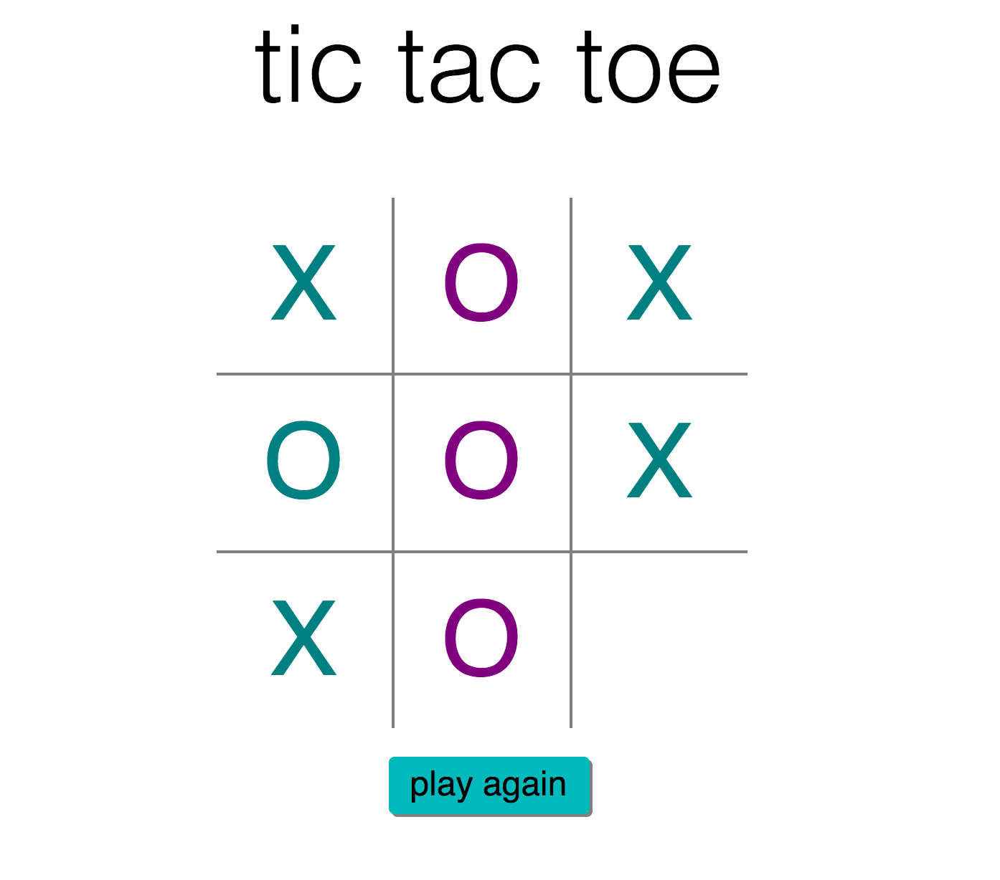

# Tic Tac Toe #
This is a Tic Tac Toe web game, complete with a computer opponent. [Play here!](https://thawing-cove-92295.herokuapp.com/)

	

## Some notes ##
- Uses the [minimax algorithm](https://en.wikipedia.org/wiki/Minimax#Combinatorial_game_theory) for the computer player. [It's explained well in the context of Tic Tac Toe here.](http://neverstopbuilding.com/minimax)
- Because minimax was slightly slow for the first move, I improved the speed somewhat by setting a max depth in the search space - so, essentially, the computer only looks ahead by a maximum of 6 moves to see which is best. If this project were more complete, I would consider using alpha-beta pruning to improve speed.
- The way it's set up now, the user could cheat manipulating the board. If I had more time, I'd store each game's state in a database rather than have the client send the game state.

## To run locally ##
- This app runs on Python 2.7
- Use requirements.txt to install dependencies
- `python app.py` from this repository's directory
- View app on `localhost:5000`
